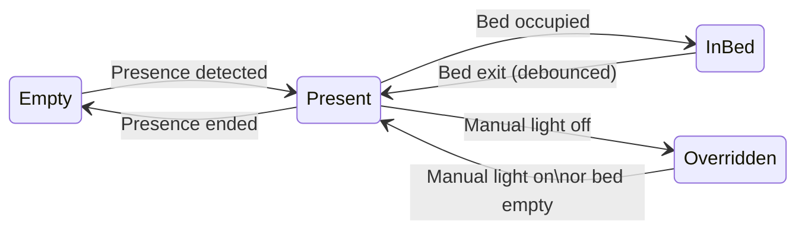
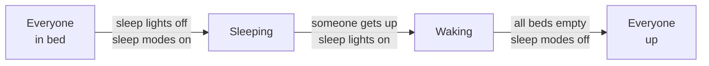

# Roommate

[](https://github.com/MarcedForLife/roommate/releases)
[](https://github.com/MarcedForLife/roommate/releases)
[](https://github.com/hacs/integration)
[](LICENSE.md)

A Home Assistant integration that automates room behaviour based on presence and bed occupancy. Configure via the UI or YAML, and the integration handles the rest.

## Features

- **Presence lighting** with configurable transitions
- **Bed occupancy** handling (dim on entry, restore on exit, wake transition)
- **Manual override detection** that suppresses presence lighting when you manually turn off a light
- **Household sleep/wake** coordination across multiple rooms
- **Quick return snapshot** that restores room state if you get back in bed within a configurable window
- **Adaptive lighting** integration (restore auto-brightness on bed exit)
- **Guest mode** switch to suppress sleep light activation
- **Live tuning** via number entities on the device page

## How it works

Each room follows a state lifecycle based on sensor events:



| State          | Room behaviour                                                  |
| -------------- | --------------------------------------------------------------- |
| **Empty**      | Lights off                                                      |
| **Present**    | Lights on (adaptive)                                            |
| **In Bed**     | Lights dimmed or off, fans/speakers controlled                  |
| **Overridden** | Presence lighting suppressed until manual light-on or bed empty |

When a room has `bed.persons` configured, it participates in the household sleep/wake lifecycle:



Sleep lights only activate if illuminance is below threshold and guest mode is off.

## Configuration

```yaml
roommate:
  # Global settings
  illuminance_sensor: sensor.illuminance   # optional
  illuminance_threshold: 4000              # lux, default 4000
  sleep_lights:                            # lights to manage on sleep/wake
    - entity_id: light.living_room_lights
      inhibit:                             # suppress this light when any is on
        - switch.theatre_lighting
    - light.toilet_light                   # simple form, no inhibitors
  sleep_modes:                             # switches to toggle on sleep/wake
    - switch.adaptive_lighting_sleep_mode_living_room

  rooms:
    bedroom:
      sensors:
        presence: binary_sensor.bedroom_mmwave         # required
        bed:                                           # optional
          presence: binary_sensor.bed_occupancy
          occupants: sensor.bed_occupant_count
          persons:
            - person.alice
            - person.bob

      lights:                                          # required
        - light.bedside_lamp_1
        - light.bedside_lamp_2
      fans:                                            # optional
        - fan.bedroom_fan
      speakers:                                        # optional
        - media_player.bedroom_speaker

      adaptive_lighting:                               # optional
        switch: switch.adaptive_lighting_bedroom
        sleep_mode: switch.adaptive_lighting_sleep_mode_bedroom

      # Tunables (all optional, shown with defaults)
      dim_brightness: 5              # percent, when getting in bed
      recently_on_threshold: 8       # seconds, skip dimming if lights just turned on
      transition_on: 2               # seconds
      transition_off: 5              # seconds
      transition_dim: 5              # seconds
      wake_transition: 30            # seconds, fade lights on when leaving bed
      bed_exit_delay: 10             # seconds, debounce before triggering bed exit
      bed_return_timeout: 180        # seconds, restore room state on quick return
      presence_off_delay: 0          # seconds, debounce before lights off
```

### Minimal room (motion sensor + lights only)

```yaml
rooms:
  guest_bedroom:
    sensors:
      presence: binary_sensor.guest_bedroom_mmwave
    lights:
      - light.guest_lamp
```

## Auto-created entities

Per room (using "bedroom" as example):

| Entity                                            | Created when                 | Purpose                                 |
| ------------------------------------------------- | ---------------------------- | --------------------------------------- |
| `binary_sensor.roommate_bedroom_presence`         | Always                       | Combined presence (motion OR bed)       |
| `sensor.roommate_bedroom_room_state`              | Always                       | Diagnostic state (empty/present/in_bed) |
| `switch.roommate_bedroom_presence_automations`    | Always                       | Toggle presence-based lighting          |
| `switch.roommate_bedroom_bed_automations`         | Bed sensor configured        | Toggle bed-related automations          |
| `button.roommate_bedroom_restore_auto_brightness` | Adaptive lighting configured | Restore auto-brightness                 |
| `number.roommate_bedroom_*`                       | Per tuning param             | Adjust timing and brightness values     |

Global:

| Entity                                   | Created when                  | Purpose                         |
| ---------------------------------------- | ----------------------------- | ------------------------------- |
| `switch.roommate_guest_mode`             | Always                        | Suppress sleep light activation |
| `number.roommate_sleep_light_transition` | Sleep lights configured       | Sleep light fade duration       |
| `number.roommate_illuminance_threshold`  | Illuminance sensor configured | Lux threshold for sleep lights  |

All entities are grouped under per-room "Roommate {Room}" devices or the global "Roommate" hub device.

## Installation

### HACS

[](https://my.home-assistant.io/redirect/hacs_repository/?owner=MarcedForLife&repository=roommate&category=Integration)

Or manually: add this repository as a custom repository in HACS, then install "Roommate."

### Manual

1. Copy `custom_components/roommate` to your HA `custom_components/` directory
2. Restart Home Assistant

### Setup

After installing, you can set up Roommate in two ways:

- **UI**: Go to Settings > Devices & Services > Add Integration, search for "Roommate"
- **YAML**: Add the configuration to your `configuration.yaml` and restart Home Assistant

## Development

### Translations

UI labels and descriptions live in `translations/`.

Room setup steps and global settings are duplicated under `config` and `options` because HA resolves translations per flow type with no way to share between them. When editing these, update both sections.
